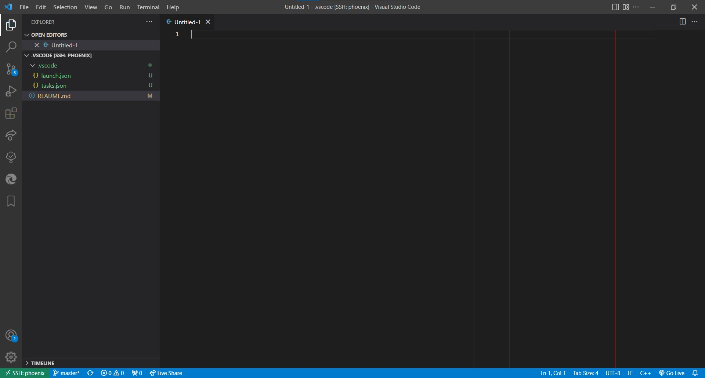

# .vscode

Useful JSON files for a VS Code workspace

## Table of Contents

* [Extensions](#extensions)
* [Layout](#layout)
* [GDB Debugger - Beyond](#gdb-debugger---beyond)

### Extensions

| Name | Developer |
|:-|:-|
| Better C++ Syntax | Jeff Hykin |
| Better Comments | Aaron Bond |
| Bookmarks | Alessandro Fragnani |
| C/C++ Themes | Microsoft |
| Microsoft Edge Tools for VS Code | Microsoft |
| Remote - SSH | Microsoft |
| Remote - SSH: Editing Configuration Files | Microsoft |
| C/C++ | Microsoft |
| C/C++ Extension Pack | Microsoft |
| Doxygen Documentation Generator | Christoph Schlosser |
| GDB Debugger - Beyond | coolchyni |
| Gitlens | GitKraken |
| Hex Editor | Microsoft |
| IntelliCode | Microsoft |
| IntelliCode API Usage Examples | Microsoft |
| Live Server | Ritwick Dey |
| Live Share | Microsoft |
| markdownlint | David Anson |
| Pylance | Microsoft |
| Python | Microsoft |
| Sourcegraph | Sourcegraph |
| Todo Tree | Gruntfuggly |
| Trailing Spaces | Shardul Mahadik |
| XML Tools | Josh Johnson |
| Yangster | Yangster |

### Layout



#### GDB Debugger - Beyond

Run this on target after setting `LD_LIBRARY_PATH` if required

```bash
gdbserver localhost:2000 ./build/test_app <command line arguments>
```
